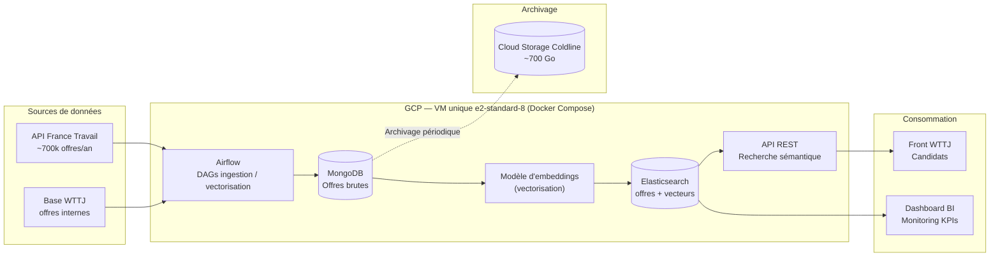
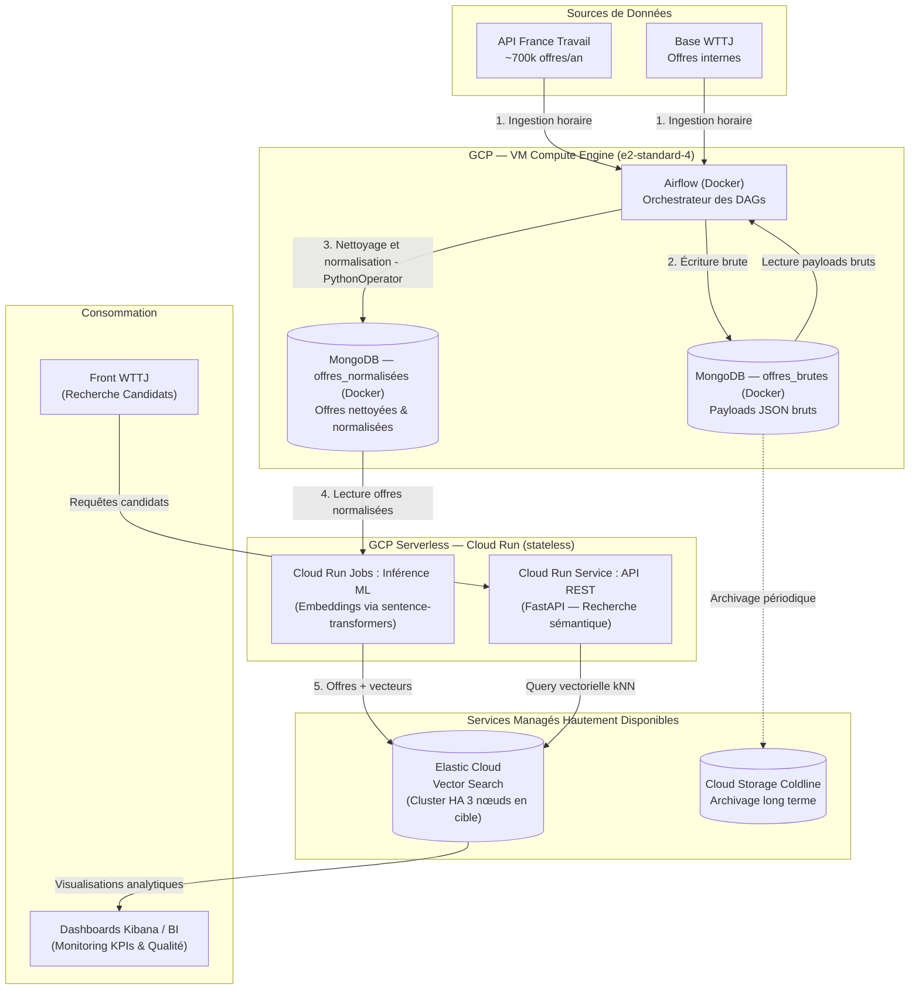

# Complément RNCP Data Engineer
## Déploiement du projet *Job Market* — Welcome to the Jungle
### Stratégie de déploiement en conditions réelles sur 18 mois

> **Posture :** Data Engineer avec une vision projet.
> **Objet :** proposer une stratégie de déploiement réaliste et justifiée (technique, humaine, budgétaire) pour la **solution complète** (au-delà du MVP), sur **18 mois**.

---

## Sommaire

1. [Contexte & rappel du projet](#1-contexte--rappel-du-projet)
2. [Architecture technique — trajectoire V1 → V2](#2-architecture-technique--trajectoire-v1--v2)
   - 2.1 [Démarche : d'une première architecture vers une cible évoluée](#21-démarche--dune-première-architecture-vers-une-cible-évoluée)
   - 2.2 [Justification de la volumétrie (~700 Go / mois)](#22-justification-de-la-volumétrie-700-go--mois)
   - 2.3 [Architecture V1 — point de départ (VM monolithique)](#23-architecture-v1--point-de-départ-vm-monolithique)
   - 2.4 [Du batch quotidien au micro-batching horaire](#24-du-batch-quotidien-au-micro-batching-horaire)
   - 2.5 [Architecture V2 — cible retenue (découplée Cloud-Native)](#25-architecture-v2--cible-retenue-découplée-cloud-native)
   - 2.6 [Arbitrages V1 → V2 et justification des composants](#26-arbitrages-v1--v2-et-justification-des-composants)
   - 2.7 [Alternatives évaluées et écartées](#27-alternatives-évaluées-et-écartées)
3. [Estimation des coûts d'infrastructure](#3-estimation-des-coûts-dinfrastructure)
4. [Organisation de l'équipe & budget RH](#4-organisation-de-léquipe--budget-rh)
5. [Planification du projet](#5-planification-du-projet)
6. [Montée en compétences](#6-montée-en-compétences)
7. [Synthèse & valeur attendue](#7-synthèse--valeur-attendue)

---

## 1. Contexte & rappel du projet

### 1.1 Rappel de la solution (issue de la Discovery)

À l'issue de la phase de Discovery (première soutenance), nous avons priorisé la problématique de la **pertinence des résultats de recherche** sur Welcome to the Jungle. Deux personas en illustrent les enjeux : *Camille* (senior C-level dont le métier « n'existe pas » dans les filtres) et *Théo* (junior noyé sous des résultats trop larges et des offres de stage/alternance non désirées).

La solution retenue combine :

- Un **moteur de recherche sémantique** basé sur des embeddings vectoriels, capable de comprendre les équivalences entre intitulés (« Chief of Staff » ≈ « Directrice des Opérations ») et de suggérer des métiers proches ;
- Un **enrichissement du catalogue** via l'API France Travail (~700 000 offres / an), pour couvrir les segments aujourd'hui sous-représentés ;
- Une **API unifiée** exposant les offres WTTJ + France Travail au front candidat.

La valeur métier attendue est double : moins de friction côté candidat (résultats adaptés à l'intention réelle), et une **hausse des candidatures qualifiées** qui constitue un argument commercial B2B direct auprès des entreprises clientes.

### 1.2 Périmètre du présent document

Ce document couvre le **déploiement de la solution complète** (au-delà du MVP) sur une période de **18 mois**, et traite les cinq axes de la mission RNCP :

1. **Architecture technique** — organisation des données et outils (stockage, traitement, visualisation) ;
2. **Estimation des coûts** — infrastructure (mensuels et totaux) et répartition du budget ;
3. **Organisation de l'équipe** — recrutement, externalisation, formation ;
4. **Planification** — phases développement, test, production ;
5. **Montée en compétences** — besoins de formation de l'équipe.

### 1.3 Hypothèses de travail

| Élément | Valeur | Source |
|---|---|---|
| Volume de données collectées | ~700 Go / mois | Énoncé projet |
| Volume de données générées (embeddings, index, snapshots) | ~1,2 To sur 18 mois | Énoncé projet |
| Volume de données archivées | ~700 Go sur 18 mois | Énoncé projet |
| Budget équipe (18 mois) | 400 000 € | Énoncé projet |
| Budget infrastructure (18 mois) | 90 000 – 110 000 € | Énoncé projet |
| Cloud provider | GCP (+ Elastic Cloud sur GCP) | Choix technique |
| Région principale | `europe-west1` (Belgique) | Proximité utilisateurs FR |

> Conformément à l'énoncé, les estimations sont volontairement simplifiées et raisonnent en **ordres de grandeur** : l'objectif est la cohérence et la justification du raisonnement, pas l'exactitude au centime.

---

## 2. Architecture technique — trajectoire V1 → V2

### 2.1 Démarche : d'une première architecture vers une cible évoluée

Notre proposition d'architecture a évolué en deux temps, et nous documentons volontairement cette trajectoire car elle illustre une démarche d'ingénierie réaliste :

- **V1 — point de départ :** une architecture **monolithique containerisée** sur une VM unique (Docker Compose). Simple, peu coûteuse, cohérente avec le MVP, mais présentant un *Single Point of Failure* (SPOF) et un profil de charge mal lissé.
- **V2 — cible retenue :** une architecture **découplée Cloud-Native**, issue d'une revue technique par un ingénieur Cloud/GCP senior. Elle conserve les forces de la V1 (maîtrise des coûts, simplicité d'exploitation) tout en éliminant le SPOF sur les briques exposées et en lissant la charge.

La V2 est l'architecture **proposée pour le déploiement**. La V1 est présentée comme socle de réflexion : elle explique *pourquoi* la V2 a la forme qu'elle a.

### 2.2 Justification de la volumétrie (~700 Go / mois)

Une question légitime du jury : pourquoi **700 Go/mois** alors qu'un catalogue de ~700 000 offres/an au format JSON « propre » ne pèserait que quelques Go ? La réponse tient à la nature d'une véritable plateforme d'ingestion data, qui capture bien plus que le seul résultat final :

| Couche de données | Nature | Pourquoi ce volume |
|---|---|---|
| **Payloads bruts & historisation (snapshots)** | JSON intégraux non nettoyés de l'API France Travail : métadonnées lourdes, référentiels entreprises et géographiques détaillés. Snapshot quotidien des offres actives. | Traçabilité, analyses de tendance (BI), étude du cycle de vie des annonces (durée de publication, évolution salaire/compétences). C'est le poste le plus volumineux. |
| **Télémétrie & logs d'interaction** | Requêtes textuelles candidats, clics, rebonds, parcours de navigation (event streams type Kafka). | Indispensables au réentraînement futur des embeddings et au scoring de pertinence. Volume élevé et continu. |
| **Buffers éphémères & multi-staging** | Fichiers temporaires de parsing, dédoublonnage, normalisation. | Empreinte disque temporaire mécanique avant archivage à froid. |

Ce raisonnement justifie de manière rigoureuse la capture de ~700 Go/mois : ce n'est pas le catalogue final qui pèse, mais **l'ensemble de la matière première data** (brut + télémétrie + intermédiaires) conservée pour fiabiliser et faire progresser le moteur sémantique.

### 2.3 Architecture V1 — point de départ (VM monolithique)

L'architecture initiale repose sur une **stack containerisée Docker** déployée sur une **unique VM Google Compute Engine**, articulée autour de trois briques co-localisées, plus Elasticsearch également hébergé sur la VM en début de projet :

- **MongoDB** — stockage intermédiaire des offres brutes (WTTJ + France Travail) ;
- **Elasticsearch** — offres normalisées + embeddings vectoriels (recherche sémantique) ;
- **Airflow** — orchestration des pipelines (ingestion → normalisation → vectorisation → indexation) ;
- **API REST** — exposition de la recherche sémantique au front.



> **Légende (si le diagramme ne s'affiche pas) :** les deux sources (France Travail + WTTJ) alimentent Airflow, qui écrit le brut dans MongoDB. Le modèle d'embeddings vectorise puis pousse dans Elasticsearch, lequel sert à la fois l'API (front candidat) et les dashboards BI. MongoDB déverse périodiquement les archives vers Cloud Storage Coldline. **Tout est sur une seule VM.**

**Forces de la V1 :** simplicité d'exploitation pour une petite équipe, reproductibilité dev/prod via Docker Compose, coût plancher, cohérence directe avec le MVP de la première soutenance.

**Limites identifiées (qui motivent la V2) :**

| Limite | Conséquence |
|---|---|
| **SPOF sur la VM** | Une panne de la VM met hors service *à la fois* l'ingestion, le calcul ML et l'API publique. Le front candidat tombe en même temps que les pipelines. |
| **Charge mal lissée** | Le batch quotidien lourd (cf. 2.4) génère un pic CPU/RAM massif → risque d'*Out-Of-Memory* lors de la vectorisation. |
| **Couplage calcul / exposition** | Un pic d'ingestion peut dégrader l'API servie aux utilisateurs, car les deux partagent les mêmes ressources. |

### 2.4 Du batch quotidien au micro-batching horaire

L'approche V1 reposait sur un **unique batch lourd quotidien** (exécution nocturne ~2 h). Cette stratégie présentait trois faiblesses : pic de charge massif à la vectorisation, fort impact en cas de plantage (rejouer 24 h de données), et fraîcheur insuffisante des offres en journée.

La V2 bascule sur une stratégie de **micro-batching horaire** (exécution toutes les 1 à 2 h par Airflow) :

| Bénéfice | Détail |
|---|---|
| **Lissage de la charge** | Au lieu de traiter ~23 Go d'un bloc, le pipeline traite ~1 Go/heure. L'empreinte CPU/mémoire est drastiquement réduite — c'est ce qui permet de **réduire la taille de la VM** (cf. 2.6). |
| **Résilience** | Si un micro-batch échoue (ex. indisponibilité temporaire de l'API), le *retry* automatique d'Airflow limite l'impact à **une heure** de données. Reprise quasi instantanée, sans interrompre l'ensemble. |
| **Valeur métier** | Les offres publiées/modifiées sur France Travail sont disponibles sur WTTJ en **moins de 2 h**, améliorant la fraîcheur du catalogue et l'attractivité de la plateforme. |

Ce changement de rythme n'est pas qu'un détail d'orchestration : c'est **le levier technique central** qui rend possible le redimensionnement à la baisse de l'infrastructure tout en améliorant la qualité de service.

### 2.5 Architecture V2 — cible retenue (découplée Cloud-Native)

La V2 applique les principes de l'architecture Cloud-Native : on **découple les briques selon leur nature**. Les composants *stateful* (qui gardent un état : orchestration, stockage brut) restent sur la VM ; les composants *stateless* à charge variable (inférence ML, API publique) migrent vers du **serverless (Cloud Run)** ; le composant critique (recherche) reste **managé** (Elastic Cloud).



> **Légende (si le diagramme ne s'affiche pas) :** Airflow (sur VM réduite) ingère France Travail + WTTJ **toutes les heures**, écrit le brut dans une collection MongoDB `offres_brutes`, puis exécute un **PythonOperator de nettoyage & normalisation** (déduplication, standardisation des champs, nettoyage HTML…) qui écrit le résultat dans une collection `offres_normalisées`. Airflow déclenche ensuite un **job Cloud Run d'inférence ML** qui lit les offres normalisées, calcule les embeddings et pousse offres + vecteurs dans **Elastic Cloud**. Le front candidat interroge une **API Cloud Run** (FastAPI) qui fait des requêtes vectorielles kNN sur Elastic Cloud. Les dashboards BI/Kibana lisent Elastic Cloud. MongoDB (`offres_brutes`) archive vers Coldline. **La VM porte l'orchestration, le stockage et la normalisation légère ; le calcul lourd et l'exposition sont externalisés.**

### 2.6 Arbitrages V1 → V2 et justification des composants

Le tableau ci-dessous récapitule ce qui change entre V1 et V2, et pourquoi chaque arbitrage est défendable.

| Composant | V1 | V2 (cible) | Justification de l'arbitrage |
|---|---|---|---|
| **Orchestration & landing zone** | Airflow + MongoDB sur VM `e2-standard-8` | Airflow + MongoDB sur VM **`e2-standard-4`** | Libérée du calcul ML et de l'API publique (partis en serverless) et soulagée par le micro-batching, la VM peut être **divisée par deux**, ce qui divise par deux son coût 24/7. |
| **Stockage documentaire brut** | MongoDB (sur VM) | MongoDB (sur VM) — deux collections : `offres_brutes` + `offres_normalisées` | Reste pertinent pour stocker nativement les payloads JSON variables de France Travail. La séparation en deux collections isole clairement les données brutes (archivage, traçabilité) des données prêtes à vectoriser (qualité garantie). Son isolation sur la VM évite qu'un pic d'ingestion impacte l'application cliente. |
| **Nettoyage & normalisation** | Scripts Python ad hoc | **Airflow `PythonOperator` (sur VM)** | Scripts Python simples (déduplication, nettoyage HTML, standardisation salaires/localisations) : charge CPU négligeable, exécution en quelques secondes par micro-batch. Les laisser sur la VM avec Airflow est naturel — ils sont *stateless* mais sans la latence de démarrage d'un conteneur Cloud Run, et sans coût à l'usage supplémentaire. |
| **Calcul / inférence ML** | Modèle d'embeddings sur la VM | **Cloud Run Jobs (serverless)** | Le calcul lourd est encapsulé dans un conteneur activé par Airflow à chaque micro-batch, scale le temps du batch, puis s'éteint. **Zéro risque d'OOM sur la VM**, paiement à l'usage uniquement. |
| **Exposition (API)** | API REST sur la VM | **Cloud Run Service (serverless)** | L'API publique est isolée et auto-scalée (de 0 à N instances selon les vagues de candidats). Si les pipelines ont une anomalie sur la VM, **l'API de recherche reste 100 % disponible**. |
| **Moteur sémantique** | Elasticsearch sur VM | **Elastic Cloud managé** (mono-nœud → HA 3 nœuds) | Cœur critique du produit. Le managé garantit HA multi-zone, sharding, sauvegardes et chiffrement **sans alourdir la charge ops** d'une petite équipe. |
| **Archivage** | GCS Coldline | GCS Coldline — *inchangé* | Les données MongoDB > 30 jours sont purgées et déversées sur Coldline (~0,004 €/Go/mois), minimisant l'usage de disques SSD coûteux. |

**Le fil rouge des arbitrages :** *« chaque brique au bon endroit selon sa nature »*. Stateful et stable → VM. Stateless et à charge variable → serverless. Critique et exigeant en disponibilité → managé. Froid et rarement lu → archivage objet. Ce principe est ce qui élimine le SPOF de la V1 tout en **réduisant** le coût d'infrastructure de base.

### 2.7 Alternatives évaluées et écartées

Avant de retenir la cible V2 (VM réduite + Cloud Run + Elastic Cloud managé), deux autres approches ont été comparées.

#### Alternative A — Tout-en-un Cloud Run (Compose)

Déployer directement le `docker-compose.yaml` sur Cloud Run.

| Pourquoi écartée | Détail |
|---|---|
| Inadapté au *stateful* | Cloud Run est pensé pour des conteneurs **stateless** avec scale-to-zero. MongoDB et Airflow sont *stateful* et doivent tourner en continu → conflit fondamental. |
| Pas d'isolation réelle | Compose déploie tout dans un unique service, sans pouvoir scaler MongoDB indépendamment d'Airflow. |
| Position officielle Google | La doc positionne Cloud Run Compose comme un outil de dev/transition, **pas une stratégie de production**. |

**Conclusion :** adapté au prototypage, inadapté à une mise en production data. *(C'est néanmoins la bonne brique pour les composants stateless isolés — d'où son usage ciblé en V2 pour le ML et l'API.)*

#### Alternative B — Kubernetes managé (GKE)

Cluster GKE avec `StatefulSets` (MongoDB, ES) et `Deployments` (Airflow, API).

| Pourquoi écartée pour ce projet | Détail |
|---|---|
| Complexité disproportionnée | Pour seulement 3-4 services, la courbe d'apprentissage K8s (manifests, RBAC, ingress, network policies) n'est pas rentable. |
| Incohérence RH | Le Cloud Engineer est externalisé → maintenir un cluster K8s au quotidien sans expertise interne forte est risqué. |
| Pas de gain sur le vrai SPOF | Le point de fragilité est **Elasticsearch**, et le mettre dans K8s (opérateur ECK) apporte autant de complexité qu'Elastic Cloud avec moins de garanties. |
| Coût supérieur | ~450-700 €/mois pour un cluster HA minimal, sans gain métier proportionnel. |

**Position retenue :** GKE est une **cible d'évolution à 24-36 mois** si la plateforme s'étend (scoring CV, recommandation entreprises…). L'architecture V2 étant déjà containerisée et pilotée par IaC, cette migration future reste ouverte sans refonte.

#### Synthèse comparative

| Critère | Cloud Run Compose | GKE | **V2 : VM réduite + Cloud Run + Elastic Cloud** ✅ |
|---|:---:|:---:|:---:|
| Adapté aux workloads *stateful* | ❌ | ✅ | ✅ |
| API publique résiliente & auto-scalée | ⚠️ | ✅ | ✅ (Cloud Run) |
| HA multi-zone sur la brique critique | ❌ | ✅ | ✅ (Elastic Cloud) |
| Complexité opérationnelle | Faible | **Élevée** | Moyenne |
| Compatible équipe réduite | ✅ | ❌ | ✅ |
| Maîtrise des coûts | — | ❌ | ✅ |
| Évolutivité future (vers GKE) | ❌ | — | ✅ |

---

## 3. Estimation des coûts d'infrastructure

> **Méthode :** ordres de grandeur GCP + Elastic Cloud en région `europe-west1`, raisonnés par poste et par phase. L'objectif est un atterrissage **cohérent et justifié** dans l'enveloppe 90-110 k€, pas une facturation au centime.

### 3.1 Ce que la V2 change sur les coûts (vs V1)

L'architecture V2 modifie le profil de coût de trois manières :

| Levier V2 | Effet sur le coût |
|---|---|
| **VM divisée par deux** (`e2-standard-8` → `e2-standard-4`) | Le poste compute 24/7 de la VM passe d'environ ~210 €/mois à ~105 €/mois. |
| **ML + API en Cloud Run (à l'usage)** | On ne paie plus une VM dimensionnée pour les pics : le job ML ne coûte que pendant les ~quelques minutes de chaque micro-batch, l'API ne coûte qu'en fonction du trafic réel (scale-to-zero possible hors pointe). Coût faible mais variable. |
| **Elasticsearch managé par paliers** | Reste le poste dominant, mais activé progressivement (cf. 3.4) — on ne paie la HA que lorsqu'il y a du trafic. |

### 3.2 Coûts mensuels détaillés — régime de production (V2)

Estimation pour un mois en **phase de production établie** (la phase la plus coûteuse) :

| Poste | Détail | Coût mensuel (€) |
|---|---|---|
| **VM Compute Engine (prod)** | `e2-standard-4` (4 vCPU, 16 Go), 24/7 | ~105 € |
| **VM Compute Engine (staging)** | `e2-standard-2`, 24/7 | ~55 € |
| **Disque persistant SSD (prod)** | 1 To (MongoDB + buffers) | ~170 € |
| **Disque persistant SSD (staging)** | 500 Go | ~85 € |
| **Cloud Run — Job ML (inférence)** | ~24 exécutions/jour, courtes, CPU/mémoire à l'usage | ~80 € |
| **Cloud Run — Service API** | Auto-scaling selon trafic candidats, scale-to-zero hors pointe | ~120 € |
| **Cloud Storage Standard (chaud)** | ~200 Go (rolling buffer) | ~4 € |
| **Cloud Storage Coldline (archives)** | jusqu'à 700 Go progressifs (~0,004 €/Go/mois) | ~3 € |
| **Egress réseau** | ~500 Go/mois (API + monitoring) | ~50 € |
| **Cloud Logging / Monitoring** | Cloud Operations | ~30 € |
| **Snapshots / backups** | Incrémentaux quotidiens | ~25 € |
| **Sous-total hors Elasticsearch** | | **~730 €** |
| **Elasticsearch (Elastic Cloud)** | *variable selon palier — cf. 3.4* | 0 → ~6 500 € |

> **Lecture :** hors Elasticsearch, l'infrastructure de base de la V2 tourne autour de **~730 €/mois** en production. Le poste qui pilote réellement le budget est **Elasticsearch**, d'où la stratégie de phasage ci-dessous.

### 3.3 Projection de l'infra de base sur 18 mois (hors Elasticsearch)

Le coût de l'infra de base suit la maturité du projet (faible en dev, complet en prod) :

| Phase | Mois | Coût mensuel moyen | Sous-total |
|---|---|---|---|
| **Dev** (infra réduite, peu de Cloud Run) | M1-M7 | ~350 € | ~2 450 € |
| **Test / Staging** (montée en charge) | M8-M11 | ~600 € | ~2 400 € |
| **Production** (régime nominal) | M12-M18 | ~730 € | ~5 110 € |
| **Sous-total infra de base (hors ES)** | | | **~9 960 €** |

> La V2 réduit ce socle par rapport à la V1 (qui tablait sur ~13 000 €) grâce à la VM réduite et au paiement à l'usage de Cloud Run en phase dev (peu de trafic, peu d'inférence).

### 3.4 Phasage progressif d'Elasticsearch (le poste dominant)

Elasticsearch (cœur de la recherche sémantique) est le composant critique **et** le plus coûteux. Une stratégie en **trois paliers** aligne le niveau de fiabilité — donc le coût — sur la maturité du projet et le trafic réel.

| Palier | Période | Configuration | Justification |
|---|---|---|---|
| **Palier 1 — Self-hosted** | M1-M11 (Dev + Staging) | 1 nœud ES dans Docker, sur la VM | Pas de trafic utilisateur réel : la simplicité prime, le SPOF est acceptable. Coût quasi nul. |
| **Palier 2 — Managé mono-nœud** | M12-M14 (go-live + stabilisation) | 1 nœud Elastic Cloud (~30 Go RAM, ~500 Go) | Mise en production : on délègue patchs, backups, snapshots et monitoring à Elastic pour réduire le risque ops. La charge est encore faible → un nœud suffit. |
| **Palier 3 — Cluster HA 3 nœuds** | M15-M18 (montée en charge) | 3 nœuds Elastic Cloud sur 3 zones GCP | Trafic significatif : tolérance à la panne d'un nœud/zone, rolling restarts sans downtime, load balancing. **Pourquoi 3 et pas 2 ?** Un nombre **impair** de nœuds maîtres éligibles évite le *split-brain* (le cluster se scindant en deux moitiés se croyant chacune légitime). |

**Coûts par palier :**

| Palier | Durée | Coût mensuel ES | Sous-total ES |
|---|---|---|---|
| Palier 1 (self-hosted) | 11 mois | ~0 € (compris dans la VM) | 0 € |
| Palier 2 (managé mono-nœud) | 3 mois | ~2 200 € | ~6 600 € |
| Palier 3 (cluster HA 3 nœuds) | 4 mois | ~6 500 € | ~26 000 € |
| **Total Elasticsearch (18 mois)** | | | **~32 600 €** |

### 3.5 Budget infrastructure consolidé (18 mois)

| Poste | Détail | Coût 18 mois |
|---|---|---|
| Infra GCP de base (VM, stockage, Cloud Run, réseau, monitoring) | cf. 3.3 | ~10 000 € |
| **Elasticsearch — Palier 1** | Self-hosted, M1-M11 | 0 € |
| **Elasticsearch — Palier 2** | Managé mono-nœud, M12-M14 | ~6 600 € |
| **Elasticsearch — Palier 3** | Cluster HA 3 nœuds, M15-M18 | ~26 000 € |
| Licences & outils tiers (monitoring, observabilité) | 18 mois | ~6 000 € |
| Backups & snapshots additionnels (DR cross-region) | à partir du palier 2 | ~8 000 € |
| Tests de charge & POC infra (appui Cloud Engineer externe) | ponctuel, étalé | ~5 000 € |
| Provision imprévus & montée en charge | marge ~25 % sur ES + GCP | ~30 000 € |
| **TOTAL infrastructure** | | **~95 600 €** ✅ |

> **Atterrissage : ~95,6 k€**, dans l'enveloppe **90-110 k€**. La V2 est légèrement moins chère que la V1 (~98,6 k€) sur l'infra de base, mais nous **réinjectons l'économie dans la provision d'imprévus** : le passage en serverless rend une partie du coût *variable* (donc moins prévisible que des VM fixes), et une marge confortable est le bon réflexe pour absorber un trafic supérieur aux attentes.

### 3.6 Pourquoi ce phasage est défendable

| Argument | Détail |
|---|---|
| **Chaque euro est rattaché à une raison métier** | Pas de HA tant qu'il n'y a pas d'utilisateur ; bascule en managé quand la criticité monte ; passage en HA quand le trafic le justifie. |
| **Cohérence avec les jalons projet** | Le phasage ES suit exactement les jalons agiles : J3 (recette validée) → palier 2 ; J5 (régime nominal) → palier 3 (cf. section 5). |
| **Réversibilité** | Si la montée en charge est plus lente que prévu, on décale le palier 3 ; la provision de 30 k€ absorbe l'ajustement. |
| **Pas de big bang** | La migration self-hosted → Elastic Cloud se fait par snapshot/restore, testable en staging avant le go-live. |
| **Coût variable maîtrisé (Cloud Run)** | Le paiement à l'usage de l'inférence et de l'API évite de payer des VM dimensionnées pour des pics qui n'arrivent que quelques heures par jour. |

---

## 4. Organisation de l'équipe & budget RH

### 4.1 Analyse de l'équipe actuelle

L'équipe initiale comprend **4 profils internes** : Data Engineer, Data Analyst, ML Engineer, Cloud Engineer. Sur 18 mois avec un budget de **400 k€**, conserver 4 ETP internes est financièrement tendu (~8 300 €/mois/personne en coût chargé, peu compatible avec le marché parisien pour des profils confirmés).

**Stratégie retenue : optimisation par externalisation ciblée** des profils dont la charge n'est **pas constante** sur les 18 mois.

### 4.2 Équipe cible & mode de contractualisation

| Profil | Mode | Justification | Charge sur 18 mois |
|---|---|---|---|
| **Data Engineer** | Interne (CDI) — temps plein | Cœur du projet : pipelines, ingestion, normalisation, exploitation Airflow/MongoDB, intégration Cloud Run. Présent sur toute la durée. | 18 mois @ 100 % |
| **Data Analyst** | Interne (CDI) — temps plein | KPIs, dashboards de monitoring, suivi de la **qualité des résultats sémantiques**. Indispensable en phases test + prod. | 18 mois @ 100 % |
| **ML Engineer** | **Externalisation (freelance)** | Charge concentrée : sélection du modèle d'embeddings, fine-tuning, évaluation. Pas besoin d'un ETP permanent. | ~6 mois ETP, réparti |
| **Cloud Engineer / DevOps** | **Externalisation (prestation)** | Charge concentrée sur le setup infra + IaC (Terraform), puis ponctuel pour évolutions HA, Cloud Run et sécurité. | ~3 mois ETP, réparti |

> **Note V2 :** le découplage serverless (Cloud Run) **renforce** la pertinence de l'externalisation du Cloud Engineer : l'essentiel de son intervention est concentré sur le setup IaC initial et la configuration des services Cloud Run, avec ensuite peu d'administration récurrente (pas de cluster à opérer au quotidien).

### 4.3 Estimation du budget RH (18 mois)

| Profil | Type | Coût mensuel chargé | Durée | Sous-total |
|---|---|---|---|---|
| Data Engineer | CDI interne | ~8 000 € | 18 mois | 144 000 € |
| Data Analyst | CDI interne | ~7 000 € | 18 mois | 126 000 € |
| ML Engineer | Freelance (TJM ~700 €) | ~120 jours étalés | — | 84 000 € |
| Cloud Engineer | Prestation (TJM ~650 €) | ~60 jours étalés | — | 39 000 € |
| **Sous-total opérationnel** | | | | **393 000 €** |
| Marge formation / outillage / aléas RH | | | | ~7 000 € |
| **TOTAL RH** | | | | **~400 000 €** ✅ |

> Atterrissage exactement dans l'enveloppe **400 k€**. L'externalisation des deux profils à charge intermittente économise l'équivalent de ~75 k€ par rapport à 4 ETP internes permanents, économie réinvestie dans la durée des prestations là où la valeur est créée.

### 4.4 Matrice RACI

Légende : **R** = Responsible (réalise) · **A** = Accountable (rend des comptes) · **C** = Consulted · **I** = Informed

| Tâche / Livrable | Data Eng | Data Analyst | ML Eng (ext.) | Cloud Eng (ext.) | Product Owner |
|---|:---:|:---:|:---:|:---:|:---:|
| Architecture technique globale | R | I | C | A | I |
| Setup infra GCP / IaC Terraform | C | I | I | **R/A** | I |
| Configuration Cloud Run (ML + API) | **R** | I | C | A | I |
| Pipelines Airflow (ingestion FT + WTTJ) | **R/A** | I | I | C | I |
| Modélisation MongoDB / mapping ES | **R/A** | C | C | I | I |
| Choix & intégration modèle d'embeddings | C | I | **R/A** | I | I |
| Fine-tuning du modèle | C | I | **R/A** | I | C |
| Indexation vectorielle dans Elastic Cloud | **R** | I | C | C | A |
| API REST (recherche sémantique) | **R/A** | I | C | C | I |
| Dashboard KPIs & monitoring métier | C | **R/A** | I | I | C |
| Monitoring infra (logs, alerting) | C | I | I | **R/A** | I |
| Tests de charge & recette | C | C | C | R | **A** |
| Mise en production (go-live) | R | I | C | **R/A** | A |
| Migration ES self-hosted → Elastic Cloud | **R** | I | C | A | I |
| Documentation technique | **R** | C | C | C | I |
| Conformité RGPD / sécurité | C | I | C | **R/A** | A |

---

## 5. Planification du projet

> Section approfondie : la conduite de projet (phasage, jalons, dépendances) est un axe d'évaluation central.

### 5.1 Approche

Découpage **agile** en **3 grandes phases** sur 18 mois, sprints de **2 semaines**, jalons formels (`J`) à chaque transition de phase. Le rythme de 2 semaines est adapté à une équipe réduite : il permet des itérations rapides et des points de réajustement fréquents sans surcharge de cérémonies.

### 5.2 Phasage général

| Phase | Période | Sprints | Objectif principal |
|---|---|---|---|
| **Phase 1 — Développement** | M1 à M7 | 14 sprints | Construire la stack complète ; MVP fonctionnel en environnement de dev |
| **Phase 2 — Test & Staging** | M8 à M11 | 8 sprints | Tests de charge, recette métier, fine-tuning du modèle, hardening |
| **Phase 3 — Production** | M12 à M18 | 14 sprints | Mise en production, montée en charge, monitoring, itérations V2 produit |

### 5.3 Détail des sprints & jalons

| Mois | Sprint | Objectifs clés | Jalon |
|---|---|---|---|
| **M1** | S1-S2 | Setup GCP, IaC Terraform, repo Git, CI/CD baseline, squelette Cloud Run | 🎯 **J0** — Environnement prêt |
| **M2** | S3-S4 | Pipeline ingestion France Travail (DAG Airflow), **micro-batching horaire** | |
| **M3** | S5-S6 | Pipeline ingestion WTTJ + normalisation MongoDB | |
| **M4** | S7-S8 | Intégration modèle d'embeddings en **Cloud Run Job** (POC) + tests | 🎯 **J1** — Pipeline ingestion fonctionnel |
| **M5** | S9-S10 | Indexation Elasticsearch (self-hosted) + mapping vectoriel | |
| **M6** | S11-S12 | API REST recherche sémantique en **Cloud Run Service** (v1) | |
| **M7** | S13-S14 | Dashboard KPIs (v1) + monitoring | 🎯 **J2** — MVP complet en dev |
| **M8** | S15-S16 | Déploiement staging + tests de charge (Cloud Run + ES) | |
| **M9** | S17-S18 | Recette utilisateur (PO + Data Analyst) | |
| **M10** | S19-S20 | Fine-tuning du modèle sur données réelles | |
| **M11** | S21-S22 | Hardening sécurité, conformité RGPD, documentation | 🎯 **J3** — Recette validée → **bascule ES palier 2** |
| **M12** | S23-S24 | Mise en production progressive (*canary release*) | 🎯 **J4** — Go-live production |
| **M13-M14** | S25-S28 | Stabilisation, correctifs, ajustement des seuils | |
| **M15-M16** | S29-S32 | Optimisations performance, montée en charge | 🎯 **J5** — Régime nominal → **bascule ES palier 3 (HA)** |
| **M17-M18** | S33-S36 | Itérations produit V2 (import CV, scoring qualité des offres…) | 🎯 **J6** — Roadmap V2 livrée |

> **Alignement budget ↔ planning :** les jalons J3 et J5 ne sont pas que des étapes projet, ils **déclenchent les paliers de coût Elasticsearch** (cf. 3.4). Le planning et le budget sont ainsi explicitement synchronisés — un point que le jury apprécie en gestion de projet.

### 5.4 Vue Gantt simplifiée

```
                      M1  M2  M3  M4  M5  M6  M7  M8  M9 M10 M11 M12 M13 M14 M15 M16 M17 M18
Setup infra + IaC     ███
Ingestion FT/WTTJ         ████████
Embeddings (Cloud Run)           ██████
Indexation ES                         █████
API & dashboards                          ████████
Staging & tests                                   ████████████
Fine-tuning modèle                                    ████
Mise en prod (canary)                                             ████
ES palier 2 (managé)                                              ██████
ES palier 3 (HA)                                                              ████████
Stabilisation & V2                                                ████████████████████████
```

> **Lecture du Gantt :** les phases s'enchaînent avec recouvrement (le développement de l'API démarre avant la fin de l'indexation, le fine-tuning chevauche le staging). Les bascules de paliers Elasticsearch (managé en M12, HA en M15) sont visibles et alignées sur les jalons J4 et J5.

### 5.5 Activité par profil et par mois

> Légende : **●** = temps plein · **◑** = partiel (quelques jours/semaine) · **○** = ponctuel (quelques jours) · **—** = absent
> Les libellés décrivent la nature principale de l'activité sur le mois.

| Profil | M1 | M2 | M3 | M4 | M5 | M6 | M7 | M8 | M9 | M10 | M11 | M12 | M13 | M14 | M15 | M16 | M17 | M18 |
|---|---|---|---|---|---|---|---|---|---|---|---|---|---|---|---|---|---|---|
| **Data Engineer** | ● Setup repo, CI/CD, squelette Cloud Run | ● Pipeline ingestion FT (DAG Airflow) | ● Pipeline WTTJ + normalisation MongoDB | ● Intégration Cloud Run ML (POC) + formation | ● Indexation ES self-hosted + formation Airflow | ● API REST Cloud Run v1 | ● Dashboard KPIs v1 + monitoring | ● Déploiement staging, tests charge | ● Support recette utilisateur | ● Support fine-tuning, RGPD | ● Hardening, migration ES → managé (staging) | ● Go-live canary, migration ES palier 2 | ◑ Correctifs, stabilisation | ◑ Stabilisation, ajust. seuils | ◑ Optim. perf., migration ES palier 3 | ◑ Optimisations performance | ◑ Itérations V2 produit | ◑ Itérations V2, documentation |
| **Data Analyst** | ◑ Définition KPIs, préparation dashboards | ◑ Exploration données FT, proto dashboard | ◑ Analyse qualité offres normalisées | ◑ Suivi intégration embeddings (métriques) | ◑ Dashboard KPIs v0 (données dev) | ● Dashboard KPIs v1 + métriques qualité | ● Formation évaluation sémantique + Kibana | ● Tests recette qualité résultats (staging) | ● Recette utilisateur, analyse résultats | ● Analyse fine-tuning, RGPD | ◑ Documentation KPIs, rapport recette | ● Suivi go-live, monitoring qualité | ● Monitoring production, alertes | ◑ Analyse stabilisation | ● Monitoring montée en charge | ◑ Suivi performance, reporting | ◑ Itérations V2, nouveaux KPIs | ◑ Bilan projet, roadmap V2 |
| **ML Engineer** *(freelance)* | — | — | — | ○ Cadrage : choix modèle embeddings, POC | ● Intégration sentence-transformers, benchmarks | ● Indexation vectorielle ES, évaluation NDCG | ◑ Évaluation API recherche v1, ajustements | ◑ Préparation fine-tuning (données staging) | ● Fine-tuning modèle sur données réelles | ● Fine-tuning, évaluation finale | ○ Validation modèle, transfert compétences | ○ Support go-live (disponibilité réduite) | — | — | — | — | — | — |
| **Cloud Engineer** *(freelance)* | ● Setup GCP, IaC Terraform, réseau, sécurité | ● Config Cloud Run (ML + API), CI/CD infra | ○ Finalisations IaC, tests infra | ○ Support config Cloud Run ML (POC) | — | — | — | ○ Tests charge infra, config staging | — | — | ○ Hardening sécu, conformité infra | ● Migration ES self-hosted → Elastic Cloud palier 2 | ○ Stabilisation infra prod | — | ○ Migration ES palier 3 (HA 3 nœuds) | — | — | — |

> **Lecture pour le jury :** le ML Engineer freelance intervient sur **M4-M12** (~6 mois ETP répartis), avec un pic sur M5-M10 (sélection, intégration, fine-tuning) et une présence ponctuelle au go-live pour support. Le Cloud Engineer freelance intervient sur **M1-M2** (setup infra intensif), puis ponctuellement à chaque jalon technique clé (M4, M8, M11, M12, M15). Les deux profils internes (Data Engineer et Data Analyst) sont présents à 100 % sur toute la durée, avec une charge maximale en phase de staging/production.

### 5.6 Dépendances critiques & points de vigilance planning

| Dépendance | Risque planning | Mitigation |
|---|---|---|
| Disponibilité du ML Engineer freelance sur M4-M10 | Goulot si indisponible au moment du fine-tuning | Réserver les jours en amont, lisser la prestation, pair programming avec le Data Engineer |
| Migration ES self-hosted → managé (J3) | Risque de régression au go-live | Tester la migration snapshot/restore en staging **avant** M12 |
| Stabilité de l'API France Travail | Retard d'ingestion si changement de format | Monitoring + alertes + cache (cf. matrice des risques de la 1re soutenance) |

---

## 6. Montée en compétences

### 6.1 Diagnostic par profil

| Profil | Compétences à renforcer | Pourquoi |
|---|---|---|
| **Data Engineer** | Recherche vectorielle (Elasticsearch `dense_vector`, kNN), Airflow avancé, **déploiement & exploitation Cloud Run** | Composants cœur de la V2, peu standardisés dans une stack data classique ; le serverless est nouveau par rapport au MVP |
| **Data Analyst** | Évaluation de la recherche sémantique (NDCG, MRR), dashboards Kibana, suivi qualité d'un moteur | Le suivi qualité d'un moteur sémantique diffère du suivi BI classique |
| **ML Engineer (externe)** | À jour par défaut sur les embeddings → pas de formation à prévoir | Compétence couverte par la prestation |
| **Cloud Engineer (externe)** | À jour sur GCP / Terraform / Cloud Run → pas de formation à prévoir | Compétence couverte par la prestation |

### 6.2 Plan de formation détaillé

| Bénéficiaire | Formation | Format | Durée | Coût estimé | Période |
|---|---|---|---|---|---|
| Data Engineer | Elasticsearch — Search Engineer Certification (Elastic) | Cours officiel + certif | 5 jours | ~2 000 € | M2-M3 |
| Data Engineer | Airflow en production (best practices, monitoring) | Formation externe | 3 jours | ~1 500 € | M5 |
| Data Engineer | **GCP Cloud Run & serverless (déploiement, scaling, observabilité)** | E-learning + labs | 2 jours | ~500 € | M4 |
| Data Engineer | MongoDB University — Performance & Scaling | Auto-formation + labs | 2 jours | gratuit | M4 |
| Data Analyst | Évaluation de systèmes de recherche (Hugging Face / Coursera) | E-learning | 4 jours étalés | ~500 € | M6-M7 |
| Data Analyst | Kibana avancé (visualisations + Vega) | Formation externe | 2 jours | ~1 000 € | M7 |
| Toute l'équipe | RGPD & données personnelles (rappel + cas WTTJ) | Atelier interne + e-learning | 1 jour | ~500 € | M10 |
| **TOTAL formation** | | | | **~6 000 €** | |

### 6.3 Autres leviers de montée en compétences

- **Pair programming** régulier avec les prestataires (ML & Cloud) : transfert de compétences vers le Data Engineer pour **l'autonomisation post-prestation** — essentiel puisque les deux profils externes partent en cours de projet.
- **Documentation interne vivante** : *Architecture Decision Records* (ADR) et *runbooks* maintenus tout au long du projet, en particulier pour les opérations Cloud Run et la migration ES.
- **Revue de littérature mensuelle** (papers, retours d'expérience) — créneau de 2 h en équipe, pour rester à jour sur les modèles d'embeddings et la recherche vectorielle.

---

## 7. Synthèse & valeur attendue

### 7.1 Budget global (récapitulatif équipe + infrastructure)

| Poste | Montant 18 mois | Part |
|---|---|---|
| Équipe (RH, formation incluse) | ~400 000 € | ~81 % |
| Infrastructure (GCP + Elastic Cloud + outils) | ~95 600 € | ~19 % |
| **TOTAL projet** | **~495 600 €** | 100 % |

Les deux enveloppes imposées sont respectées : **RH ≈ 400 k€** (cible exacte) et **infra ≈ 95,6 k€** (dans la fourchette 90-110 k€).

### 7.2 Justification globale des choix

| Décision | Raison |
|---|---|
| **Trajectoire V1 → V2 assumée** | Montrer une démarche d'amélioration continue : une première archi simple, revue par un regard senior, fait émerger une cible plus résiliente sans exploser les coûts. |
| **Découplage Cloud-Native (V2)** | Chaque brique au bon endroit : *stateful* → VM, *stateless* à charge variable → Cloud Run, critique → Elastic Cloud managé. Élimine le SPOF des composants exposés. |
| **Micro-batching horaire** | Lisse la charge (permet la VM réduite), améliore la résilience (retry à l'heure) et la fraîcheur du catalogue (< 2 h). |
| **VM réduite + serverless** | Maîtrise des coûts : on ne paie plus une VM dimensionnée pour les pics ; l'inférence et l'API sont facturées à l'usage. |
| **Elasticsearch managé par paliers** | On ne paie la haute disponibilité que lorsque le trafic la justifie ; phasage synchronisé sur les jalons projet. |
| **Externalisation ML & Cloud** | Charges intermittentes → ~75 k€ d'économie vs 4 ETP, réinvestis dans la durée des prestations utiles. |
| **Phasage agile en 3 temps** | Aligne le coût infra sur la maturité (low-cost en dev, robuste en prod) et synchronise budget et planning. |

### 7.3 Valeur attendue pour Welcome to the Jungle

**Pour les candidats** (cf. personas Camille & Théo) :
- Résultats sémantiquement pertinents : fin du décalage « mots-clés exacts » vs « intention réelle » ;
- Catalogue enrichi (+700 000 offres/an via France Travail) couvrant les segments sous-représentés (C-level pour Camille, juniors avec filtres adaptés pour Théo) ;
- Fraîcheur accrue des offres (< 2 h grâce au micro-batching) ;
- Moins de temps perdu à trier des résultats inadaptés.

**Pour WTTJ (B2B)** :
- Hausse des **candidatures qualifiées** → argument commercial direct auprès des entreprises clientes ;
- **Cercle vertueux** : plus de candidats pertinents → meilleure attractivité de l'offre employeur → nouvelles entreprises clientes ;
- Différenciation concurrentielle vs LinkedIn / Indeed sur la qualité de matching.

**Pour l'organisation interne** :
- **Architecture data réutilisable** (pipelines, embeddings, services Cloud Run) pour d'autres cas d'usage (recommandation d'entreprises, scoring de candidatures…) ;
- Montée en compétences durable sur la **recherche vectorielle** et le **serverless** — un actif stratégique ;
- Une trajectoire d'évolution lisible (vers GKE à 24-36 mois) sans dette d'architecture.

### 7.4 Risques résiduels & points d'attention

| Risque | Mitigation |
|---|---|
| Volumétrie supérieure aux prévisions | Provision infra (~30 k€) + paliers ES réversibles |
| Coût Cloud Run variable difficile à prévoir | Quotas et alertes de budget GCP ; scale-to-zero hors pointe ; suivi mensuel |
| Dépendance à l'API France Travail | Monitoring + cache + alertes sur changement de format |
| Perte de compétences après les prestations | Pair programming + ADR/runbooks + formations internes |
| Performance ES en montée en charge | Tests de charge en staging + bascule HA (palier 3) au jalon J5 |

---

*Document préparé dans le cadre du complément RNCP Data Engineer — projet fictif Welcome to the Jungle / Job Market. Architecture V2 issue d'une revue technique senior intégrant micro-batching horaire, découplage serverless (Cloud Run) et Elasticsearch managé par paliers.*
